# Coolify Auto-Deploy Setup Guide

This guide will help you configure Coolify to automatically deploy your Next.js application whenever you push changes to your GitHub repository.

## Overview

Coolify's auto-deploy feature monitors your Git repository and automatically triggers a new deployment whenever you push changes to the configured branch. This eliminates the need for manual deployments or complex CI/CD pipelines.

## Prerequisites

- ✅ Coolify installed and running on your VPS
- ✅ GitHub repository: `https://github.com/marvinngalonde/Kp3Site.git`
- ✅ Docker configuration files in your repository
- 🔑 SSH key or GitHub token for repository access

## Step-by-Step Setup

### 1. Access Your Coolify Dashboard

1. Open your browser and navigate to your Coolify instance
2. Log in with your credentials
3. Navigate to the main dashboard

### 2. Create a New Application

1. Click **"+ New Resource"** or **"Add Application"**
2. Select **"Public Repository"** or **"Private Repository"** (if private, you'll need to add deploy keys)
3. Enter your repository details:
   ```
   Repository URL: https://github.com/marvinngalonde/Kp3Site.git
   Branch: main
   ```

### 3. Configure Build Settings

#### Build Pack Selection
- Select **"Dockerfile"** as the build pack
- Coolify will automatically detect your `Dockerfile`

#### Build Configuration
```yaml
Build Method: Dockerfile
Dockerfile Location: ./Dockerfile
Docker Build Context: .
```

#### Port Configuration
```yaml
Port: 3000
Protocol: HTTP
```

> [!IMPORTANT]
> The port **must** be set to `3000` to match the port exposed in your Dockerfile.

### 4. Enable Auto-Deploy

1. In the application settings, find **"Auto Deploy"** or **"Deployment"** section
2. Toggle **"Enable Automatic Deployment"** to **ON**
3. Configure deployment settings:

```yaml
Auto Deploy: Enabled ✓
Deploy Branch: main
Deploy on Push: Yes ✓
```

#### What This Does:
- Coolify creates a webhook in your GitHub repository
- Every push to the `main` branch triggers an automatic deployment
- No manual intervention required

### 5. Configure GitHub Webhook (Automatic)

Coolify will automatically create a webhook in your GitHub repository. You can verify this:

1. Go to your GitHub repository: `https://github.com/marvinngalonde/Kp3Site`
2. Navigate to **Settings** → **Webhooks**
3. You should see a webhook pointing to your Coolify instance

**Webhook Details:**
- Payload URL: `https://your-coolify-domain/api/v1/webhooks/...`
- Content type: `application/json`
- Events: `push` events on the `main` branch

> [!NOTE]
> If the webhook wasn't created automatically, you may need to add a GitHub Personal Access Token in Coolify's settings.

### 6. Set Environment Variables (Optional)

If your application requires environment variables:

1. In Coolify, go to **"Environment Variables"** tab
2. Click **"+ Add Variable"**
3. Add your variables:

```bash
NODE_ENV=production
NEXT_PUBLIC_SITE_URL=https://your-domain.com
# Add any other variables your app needs
```

> [!TIP]
> Variables prefixed with `NEXT_PUBLIC_` are exposed to the browser in Next.js applications.

### 7. Configure Domain

1. Go to the **"Domains"** section in your application settings
2. Add your domain:
   - **Option A**: Use Coolify subdomain (e.g., `kp3site.your-coolify-domain.com`)
   - **Option B**: Add custom domain (e.g., `www.yoursite.com`)

3. For custom domains:
   - Add a DNS A record pointing to your VPS IP
   - Or add a CNAME record pointing to your Coolify domain
   - Coolify will automatically provision SSL/TLS certificates via Let's Encrypt

**DNS Configuration Example:**
```
Type: A
Name: @ (or www)
Value: YOUR_VPS_IP_ADDRESS
TTL: 3600
```

### 8. Initial Deployment

1. Click **"Deploy"** or **"Start Deployment"** button
2. Coolify will:
   - Clone your repository
   - Build the Docker image using your Dockerfile
   - Start the container
   - Configure the reverse proxy
   - Set up SSL/TLS (if domain configured)

3. Monitor the deployment logs in real-time
4. Wait for the status to show **"Running"** or **"Healthy"**

### 9. Verify Auto-Deploy Works

Test that auto-deploy is working:

1. Make a small change to your code locally:
   ```bash
   # Example: Update a text in your app
   echo "// Auto-deploy test" >> app/page.tsx
   ```

2. Commit and push to GitHub:
   ```bash
   git add .
   git commit -m "Test auto-deploy"
   git push origin main
   ```

3. Watch Coolify dashboard:
   - A new deployment should start automatically within seconds
   - Monitor the build logs
   - Verify the changes appear on your live site

## Deployment Workflow

Here's what happens on every push:

```mermaid
graph LR
    A[Push to GitHub] -->|Webhook| B[Coolify Receives Event]
    B --> C[Clone Repository]
    C --> D[Build Docker Image]
    D --> E[Run Tests/Checks]
    E --> F[Stop Old Container]
    F --> G[Start New Container]
    G --> H[Health Check]
    H --> I[Update Proxy]
    I --> J[Deployment Complete]
```



**Timeline:**
1. **Push to GitHub**: Instant
2. **Webhook trigger**: 1-5 seconds
3. **Build process**: 2-5 minutes (first build), 30-90 seconds (subsequent builds with cache)
4. **Container start**: 5-10 seconds
5. **Total**: ~3-6 minutes for first deploy, ~1-2 minutes for updates

## Advanced Configuration

### Build Cache

Enable build cache for faster deployments:

1. In Coolify settings, enable **"Docker Build Cache"**
2. This caches Docker layers between builds
3. Reduces build time by 50-80%

### Health Checks

Configure health checks to ensure your app is running:

```yaml
Health Check Path: /
Health Check Port: 3000
Health Check Interval: 30s
Health Check Timeout: 10s
Health Check Retries: 3
```

### Resource Limits

Set resource limits to prevent your app from consuming too much:

```yaml
CPU Limit: 1.0 (1 core)
Memory Limit: 1024 MB (1 GB)
Memory Reservation: 512 MB
```

### Deployment Strategy

Choose your deployment strategy:

- **Rolling Update** (default): Zero-downtime deployment
- **Recreate**: Stop old container, then start new one (brief downtime)

### Multiple Environments

Set up staging and production environments:

1. **Production**: Auto-deploy from `main` branch
2. **Staging**: Auto-deploy from `develop` branch

Create a second application in Coolify for staging:
```yaml
Repository: https://github.com/marvinngalonde/Kp3Site.git
Branch: develop
Domain: staging.yoursite.com
```

## Monitoring and Logs

### View Deployment Logs

1. In Coolify dashboard, click on your application
2. Go to **"Deployments"** tab
3. Click on any deployment to view logs
4. Monitor build progress and errors

### View Application Logs

1. Go to **"Logs"** tab
2. View real-time container logs
3. Filter by log level or search for specific messages

### Deployment History

1. Go to **"Deployments"** tab
2. View all past deployments
3. See deployment status, duration, and commit info
4. Rollback to previous deployment if needed

## Troubleshooting

### Auto-Deploy Not Triggering

**Problem**: Pushing to GitHub doesn't trigger deployment

**Solutions**:
1. Check webhook in GitHub Settings → Webhooks
2. Verify webhook is active and has recent deliveries
3. Check webhook payload for errors
4. Ensure branch name matches (`main` vs `master`)
5. Re-create webhook in Coolify if needed

### Build Fails

**Problem**: Docker build fails during deployment

**Solutions**:
1. Check build logs in Coolify
2. Verify Dockerfile syntax locally:
   ```bash
   docker build -t test .
   ```
3. Ensure all dependencies are in `package.json`
4. Check for missing environment variables
5. Increase build timeout in Coolify settings

### Container Won't Start

**Problem**: Build succeeds but container crashes

**Solutions**:
1. Check container logs in Coolify
2. Verify port configuration (should be 3000)
3. Check for missing environment variables
4. Test locally with Docker:
   ```bash
   docker build -t kp3site .
   docker run -p 3000:3000 kp3site
   ```

### Slow Deployments

**Problem**: Deployments take too long

**Solutions**:
1. Enable Docker build cache
2. Optimize Dockerfile (use multi-stage builds - already done ✓)
3. Reduce dependencies in `package.json`
4. Use `.dockerignore` to exclude unnecessary files (already done ✓)
5. Increase VPS resources if needed

### SSL Certificate Issues

**Problem**: HTTPS not working or certificate errors

**Solutions**:
1. Verify DNS is pointing to correct IP
2. Wait for DNS propagation (up to 48 hours)
3. Check Coolify SSL settings
4. Manually trigger certificate renewal in Coolify
5. Ensure port 80 and 443 are open on VPS

## Rollback Procedure

If a deployment breaks your app:

1. Go to **"Deployments"** tab in Coolify
2. Find the last working deployment
3. Click **"Redeploy"** on that version
4. Or manually revert your Git commit:
   ```bash
   git revert HEAD
   git push origin main
   ```

## Best Practices

### 1. Use Branch Protection

Protect your `main` branch in GitHub:
- Settings → Branches → Add rule
- Require pull request reviews
- Require status checks to pass

### 2. Test Before Pushing

Always test locally before pushing:
```bash
npm run build
npm start
# Or test with Docker
docker build -t kp3site .
docker run -p 3000:3000 kp3site
```

### 3. Use Meaningful Commit Messages

Good commit messages help track deployments:
```bash
git commit -m "feat: Add new contact form"
git commit -m "fix: Resolve mobile navigation bug"
git commit -m "chore: Update dependencies"
```

### 4. Monitor Deployments

- Check Coolify dashboard after pushing
- Verify deployment succeeds
- Test the live site after deployment

### 5. Keep Dependencies Updated

Regularly update dependencies:
```bash
npm update
npm audit fix
```

### 6. Use Environment Variables

Never commit secrets to Git:
- Use `.env.local` for local development
- Set environment variables in Coolify
- Use `.env.example` to document required variables

## Security Considerations

### 1. Webhook Security

Coolify webhooks are secured with:
- Unique webhook URLs
- Signature verification
- IP whitelisting (optional)

### 2. Container Security

Your Docker setup includes:
- ✅ Non-root user
- ✅ Minimal base image (Alpine)
- ✅ No secrets in image
- ✅ Environment variables for sensitive data

### 3. SSL/TLS

Coolify automatically provisions SSL certificates:
- Let's Encrypt certificates
- Auto-renewal
- HTTPS enforcement

## Cost Considerations

### VPS Resources

Recommended VPS specs:
- **Development**: 1 CPU, 1 GB RAM, 20 GB SSD (~$5-10/month)
- **Production**: 2 CPU, 2 GB RAM, 40 GB SSD (~$10-20/month)
- **High Traffic**: 4 CPU, 4 GB RAM, 80 GB SSD (~$20-40/month)

### Coolify Pricing

Coolify is free and open-source:
- No licensing fees
- No deployment limits
- Self-hosted on your VPS

## Summary

Your auto-deploy setup:

✅ **Configured**:
- Coolify monitors your GitHub repository
- Auto-deploys on push to `main` branch
- Builds using your Dockerfile
- Zero-downtime deployments
- Automatic SSL/TLS certificates

🚀 **Workflow**:
1. Make code changes locally
2. Commit and push to GitHub
3. Coolify automatically deploys
4. Changes go live in 1-2 minutes

📊 **Monitoring**:
- Real-time deployment logs
- Application logs
- Deployment history
- Health checks

## Next Steps

1. ✅ Complete Coolify application setup
2. ✅ Enable auto-deploy
3. ✅ Configure domain (optional)
4. ✅ Set environment variables (if needed)
5. ✅ Test with a push to main
6. ✅ Monitor first deployment
7. ✅ Verify site is live

**You're all set!** Every push to `main` will now automatically deploy to your VPS. 🎉
